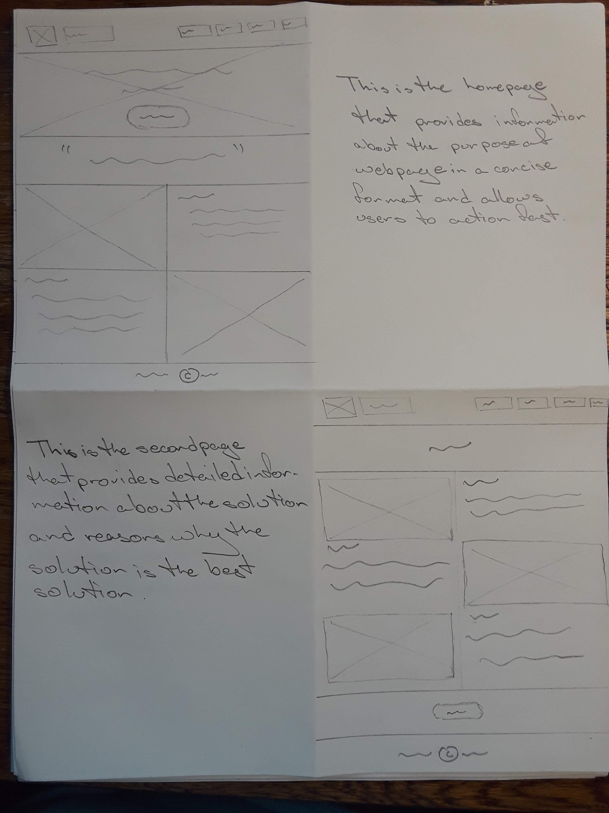
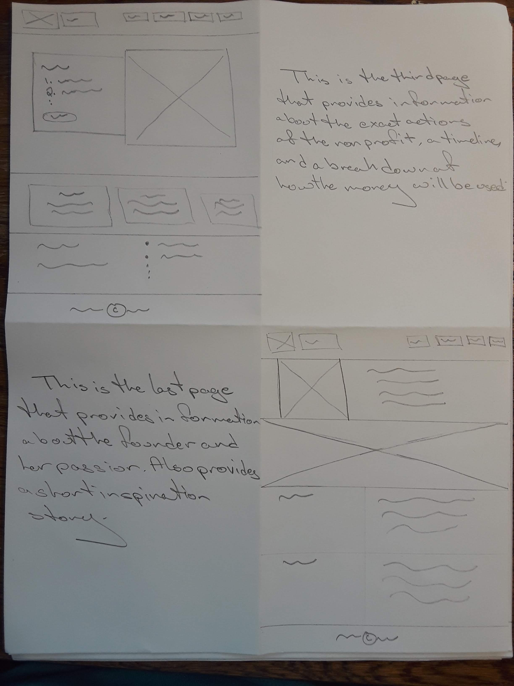
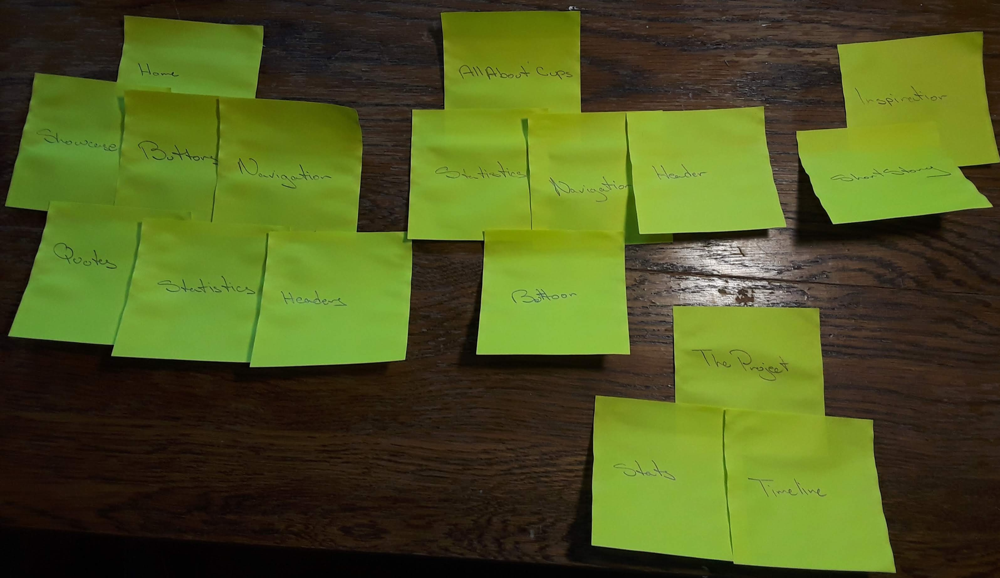
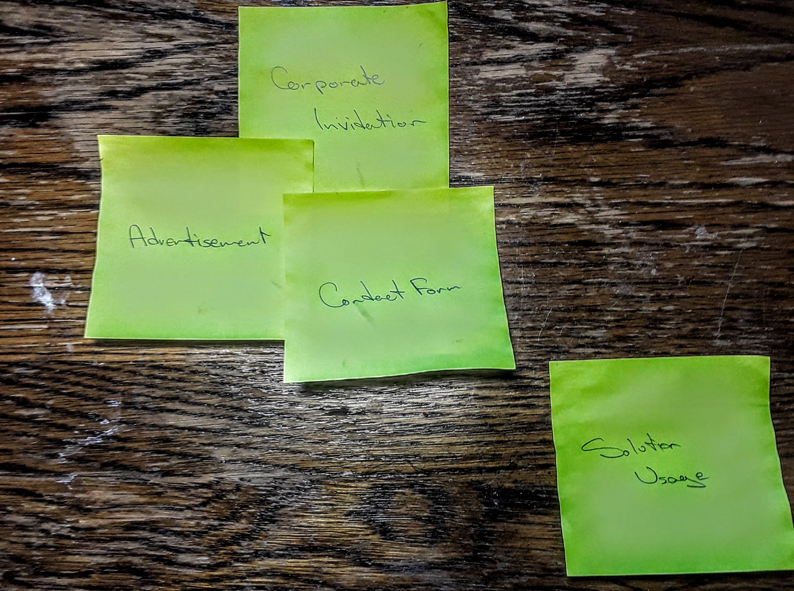
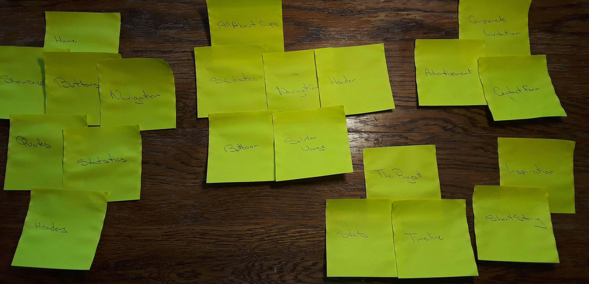
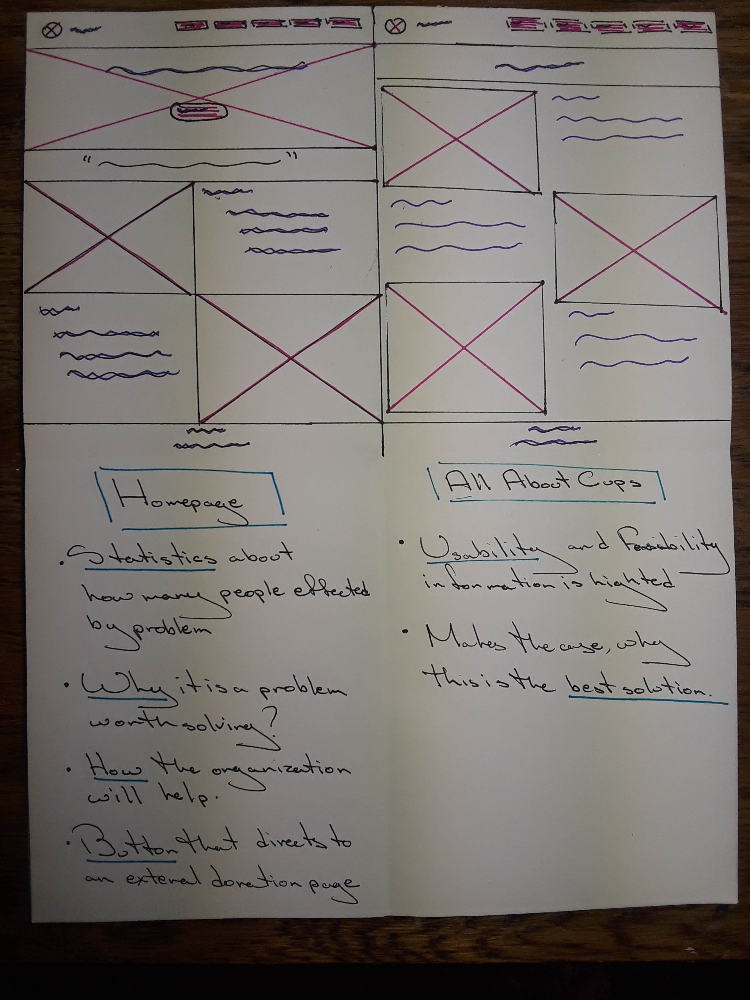
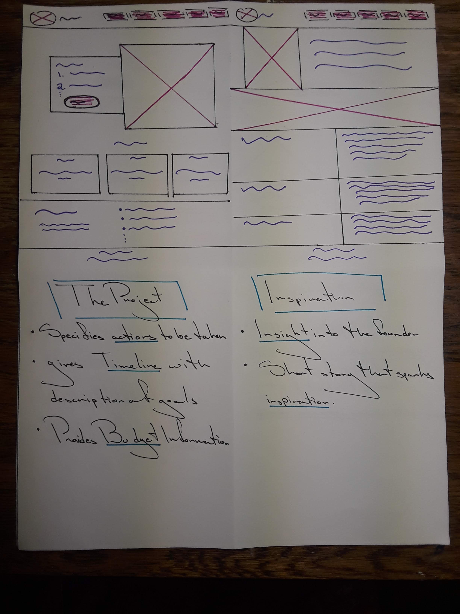
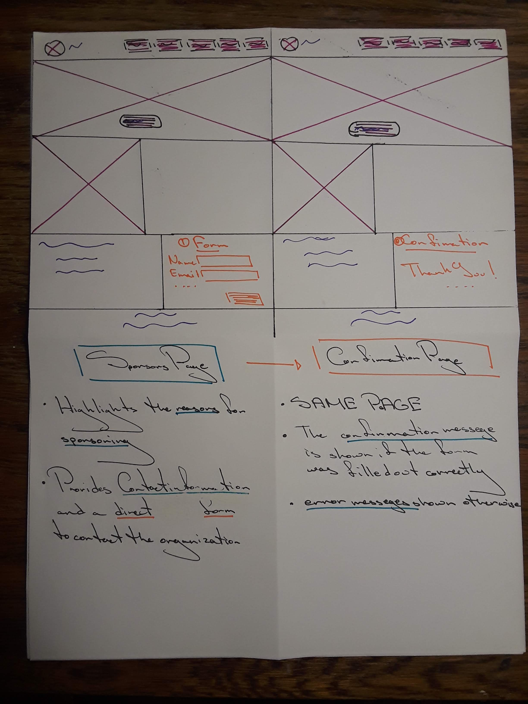
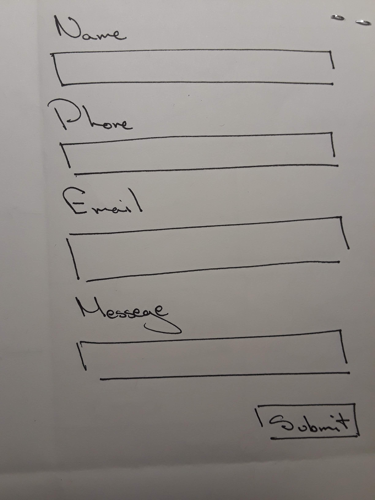
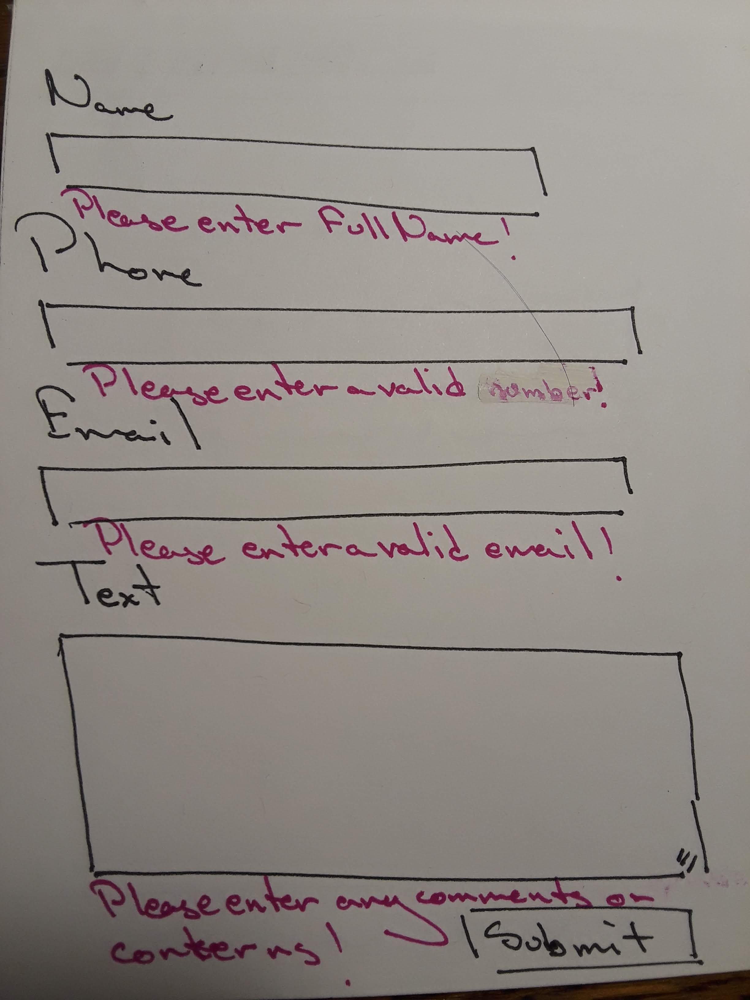

# Project 1: Design Journey

Be clear and concise in your writing. Bullets points are encouraged.

**Everything, including images, must be visible in Markdown Preview.** If it's not visible in Markdown Preview, then we won't grade it. We won't give you partial credit either. This is your warning.

## Existing Design, Planning, & Refined Design (Milestone 1)

### Existing Site: Target Audience I (Milestone 1)
Affluent Women, who empathize with the problem of menstruation, thus would be interested in helping those who lack basic neccessities when it comes to its management. This audience has enough resources to want to do philanthropic work, and since this is a problem they have personally been through, they will be willing to donate to the cause specifically.

### Existing Site: Target Audience I Needs (Milestone 1)

- Need #1: Information
  - **Need**
    - What does your existing target audience need?
    - Information about what the non-profit is trying to solve and a gist of what they will do to solve it.

  - **Design Choices**
    - How does your existing site meet this need?
    - Home page provides infomation about the lack of menstrual resources in developing countries, how it is negatively affecting people's lives, and how the non-profit will go about solving this problem.

  - **Need**
    - What action specifically will the non-profit will take to solve it?

  - **Design Choices**
    - The Project page provides information about the steps the non-profit will take to enact their solution and a basic timeline of when everything will happen.

  - **Need**
   - What are the benefits of this solution?

  - **Design Choices**
    - The All About Cups page gives the three most important criteria that this solution addresses and feasibly solves to convince the audience that this is the best solution for the problem.

  - **Need**
    - How one can go about donating?

  - **Design Choices**
    - Buttons appear throughout most of the pages that ask the audience to take action and leads them to an external donation page.

  - **Need**
   - What will happen to their money once they have donated(how will it be used)?

  - **Design Choices**
    - The Project Page includes a block of Budget information explaning exactly how the donations will be used.

  - **Need**
  - Why is the non profit working on this problem?

  - **Design Choices**
    - The Inspiration page writes a short story that allows to audience to empathize with the victims of this problem and understand the urgency of it.

  - **Need**
    - Who is working at the non-profit to solve the problem

  - **Design Choices**
    - The Inspiration page also gives information about the founder of the non-profit and why she is interested in solving the problem. This allows the audience to see behind the organization and provides an insight into the poeple working to make things happen thus gaining more trust.

 - Need #2: Statistics.
  - **Need**
    - Statistics about the solution and the problem.

  - **Design Choices**
    - Embedded into each of the text areas throughout the site, so that people can easily grasp the gravity of the problem and the effectiveness of the solution.

- Need #3: Navigation
  - **Need**
    - A way to go to the different pages and easily manuever between them.

  - **Design Choices**
    - The navigation bar is implemented for this need. It highlights the page the user is currently on thus making it easier for them to understand where they are on the site.

- Need #4: Fast Information
  - **Need**
    - The user who doesn't have a lot of time but is still interested in the non-profit needs to gather information fast and be convinced to donate.

  - **Design Choices**
    - Showcase areas, big quotes, and header are used to help guide the user to find the information they think is important as fast as possible.

- Need #5: Aesthetically Pleasing
  - **Need**
    - The user needs to feel invited to the website to be convinced to donate.

  - **Design Choices**
    - Pictures are used throughout the website, so that users don't get bored reading lots of text. The color scheme of the website is consistent throughout the different pages and to the purpose of the non-profit so that the user can feel immeresed into the subject.

Need #6: Timeline
  - **Need**
    - The audince should have an idea of when the goals of the non-profit will be accomplished.

  - **Design Choices**
    - A feature describing blocks of time and goals that will be accomplished within the frame is highlighted in The Project page.


### Existing Site: Design/Sketches (Milestone 1)
> Sketch your existing site. Include these sketches here.
> DO NOT COPY SKETCHES FROM THE ORIGINAL ASSIGNMENT! Create new sketches here. This is part of the design process to get you thinking about the strengths/weaknesses of the current design.
> Provide a brief explanation _underneath_ each sketch.





The description of each page is next to the sketch.

### Refined Site: Target Audience II (Milestone 1)
> Who is your additional/secondary target audience?

Corporate businesses who may interested in donating products or services. This audience is more focused on companies like Diva Cup, Luna Cup, or menstrual product companies.

### Refined Site: Target Audience II Needs (Milestone 1)

- Need #1: Corporate Invitation
  - **Need**
    - > What does your target audience II need?
    - Information about how businesses can benefit from donating.

  - **Design Ideas and Choices**
    - > How will you refine your site's design to meet this need?
    - An information box listing ways of corporate involvement and how they can benefit from it.

- Need #2: Contact form
  - **Need**
    - A way to contact the non-profit to either find out more information or donate products.

  - **Design Ideas and Choices**
    - A form to submit from the website to contact the non-profit directly.

- Need #3: Sponsor Advertisement
  - **Need**
    - A feature that shines light on businesses that donated so they can get more exposure.

  - **Design Ideas and Choices**
    - An advertisement area listing the companies that helped, information about their mission, and a link to thier site.

- Need #4: Solution Usage
  - **Need**
    - To inform how to use the solution implemented

  - **Design Ideas and Choices**
    - A feature, maybe pictures, a video, or a list explaning how to use the solution.


### Refined Site: Content Organization/Navigation (Milestone 1)
> Identify the content that is necessary for both target audiences.
> List the content here.
> Don't forget to include the form.

- Information
  - Home Page
  - All About Cups
  - The Project
  - Inspiration
  - Stattistics
  - Timeline
- Fast Information
  - Quotes
  - Showcase Areas
  - Donation Buttons
  - Headers
- Corporate Invitation
- Navigation
- Contact Form


> Organize the content for the target audience and identify possible pages for the content using card sorting.
> First, organize the content for target audience I. Document your card sorting by taking a photo and including it here.



> Second, organize the content for target audience II. Document your card sorting by taking a photo and including it here.



> Next, organize the content for both target audiences. Document your card sorting by taking a photo and including it here.



> Lastly, list the pages that resulted from your final card sort (i.e. your site's navigation).

- Homepage
- All About Cups
- The Project
- Inspiration
- Sponsors(Corporate Invitation)


### Refined Site: Design (Milestone 1)
> Refine the design of your site to meet the needs of _both_ target audiences.
> Include sketches of each page of the refined design.
> Provide a brief explanation _underneath_ each sketch.
> Document your _entire_ design process. **Show your preliminary sketches and your final sketches.**
> Don't forget the form and confirmation page!







The description of each page is next to the sketches.


### Partial Plan (Milestone 1)
> Using your refined sketches, plan your site's partials.
> You may describe each partial or sketch it. It's up to you!

Since the navigation bar shows up in every page it will be implemented using a partial. It will include the name of the organization, as well as links to every page in the website.

Also the footer includes copyright information that is shown is every page, so that will be implemented using a partial.

---

## Sticky Form Planning (Milestone 2)

### Sticky Form (Milestone 2)
> What controls do you need for your form?

In order to collect the proper information from the audience, we must know at least their full name, email, phone number and their comments or concerns.


> Plan out your feedback messages for your form. You may sketch (probably the easiest) or write it out.



- The Name input will allow text and will be validated to see if it is a string.

- The Phone input will be type integer and will be validated using conditional statements.

- The email will be type email and validated to see if it is string.

- The Messege input will also be a text field and validated using string.




- All of the inputs will be required for the form to be submitted, otherwise error messeges will be shown.


- If all the inputs are correct, the confirmation page is shown.


> How does this form meet the needs of at least one of your target audiences (specify which)?

This form is mostly for any corporate sponsors who may want to donate products or services. Since this process can get a little complicated, it's best for the company to contact the organization directly to communicate how to proceed. The form only has four inputs to make it quick and easy for the the corporate representative get in contact, while also recieving critical information about the company.


### Validation Code Plan (Milestone 2)
> Write out your pseudocode plan for handling the validation of the form.

```
Creat a form with correct types of fields in the form.

Get the inputs.

If an input is wrong(check using validation functions or conditional statements), provide an error messege that corresponds to that input in the same page near the input, so that users know what to change.

Make sure to that the inputs are sitcky so that the user doesn't have to repeatedly type the inputs.

If all the inputs are correct, show confirmation messege.
```

---

## Complete & Polished Website (Final Submission)

### Target Audiences (Final Submission)
> Tell us how your final site meets the needs of the target audiences. Be specific here. Tell us how you tailored your design, content, etc. to make your website usable by both target audiences.

For both target audiences, the first page works as an attention grabber with latge statistics, big quotes, a summary of the problem, and the solution the organization asking help for. It also directs them to an external link where they can donate if they are convinced.

For anyone seeking detailed information about the solution, the All About Cups page provides a concise reasoning for why the solution is the best for the problem.

For the affluent women who like to be more informed and feel connected to the organizations they donate to, The Project page provides details of the specific goals that will be accomplished and when and the Inspiration page provides an insight into the organizations founder and the reason she is so invested into the problem.

To cater to the Corporate businesses, the navigation bar indicates a Sponsors page that they can get to from the home page. This is done so that, if they want to get involved but don't have too much time to dive deep into the organization, they can quickly go to the sponsors page and submit the contact form.


### Additional Design Justifications (Final Submission)
> If you feel like you haven’t fully explained your design choices in the final submission, or you want to explain some functions in your site (e.g., if you feel like you make a special design choice which might not meet the final requirement), you can use the additional design justifications to justify your design choices. Remember, this is place for you to justify your design choices which you haven’t covered in the design journey. You don’t need to fill out this section if you think all design choices have been well explained in the design journey.

Instead of having a separate page for the confirmation, I decided to do it within the form block, as there wasn't enough information to create a whole new page for. Creating a new page would just waste space, so including a confirmation messege within the form block also minimizes clutter within the website.

### Self-Reflection (Final Submission)
> Reflect on what you learned during this assignment. How have you improved from 1300? What things did you have trouble with?

Creating a new website and going through the design process really gave me an insight into the minute details that you have to take into consideration when designing a website. A lot of times, without the design process, one can get carried away with features and texts they want to include in a website. The design process reigns in that run-on sense of thinking and makes the website concise and efficient. It induces the sense that the website is for the audience not the creator. Thus, instead of glamorous or complex features, the most efficient way to get information across is the best.
